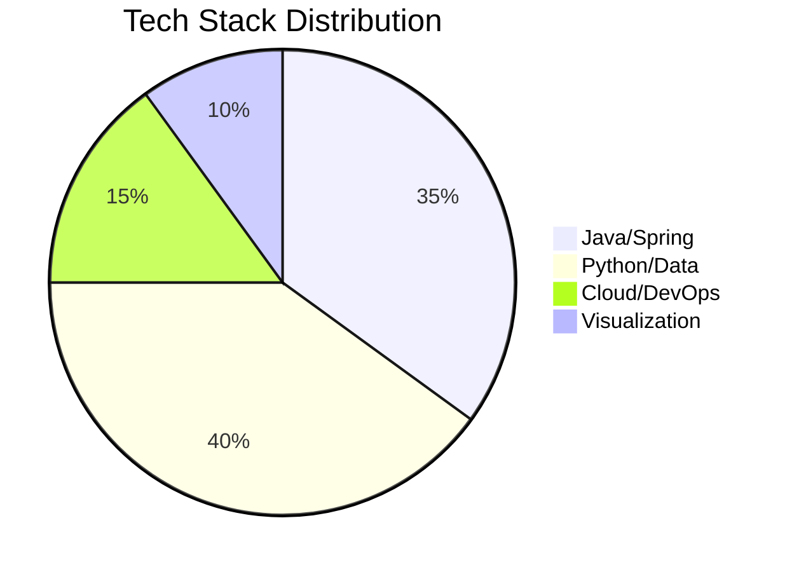

# 🚀 Rahul Naik's Supercharged GitHub Profile

<div align="center">
  
🎯 **Seeking Roles in**: Data Science | Backend Engineering | Cloud Solutions  
🔥 **Tech Stack**: Python, Java, Spark, AWS, PowerBI  
💡 **Passions**: Open Source | ML Engineering | Data Visualization  
🌱 **Currently Learning**: LLMs | Kubernetes | Data Engineering  

</div>

---

## 🌌 3D Code Galaxy Visualization

[](https://github.com/RahulNaik2611)

---

## 🛠️ Tech Stack Breakdown



---

## 📊 Dynamic Skill Matrix

```mermaid
radarChart
    title "Skill Proficiency"
    axis "Languages", "Data", "Cloud", "DevOps", "Viz"
    "Java" 90, "Python" 95, "SQL" 85
    "Pandas" 88, "Spark" 80, "PowerBI" 92
    "AWS" 75, "Docker" 82
    "Git" 90, "CI/CD" 78
    "Tableau" 85, "Matplotlib" 88
```

---

## ⚡ Real-Time Stats

<div align="center">

[](https://git.io/streak-stats)

[](https://github.com/RahulNaik2611)

[](https://github.com/RahulNaik2611)

</div>

---

## 🌟 Contribution Heatmap

[](https://github.com/RahulNaik2611)

---

## 🏆 Interactive Trophy Case

[](https://github.com/ryo-ma/github-profile-trophy)

---

## 🚀 Featured Projects

<div align="center" style="display: grid; grid-template-columns: repeat(auto-fit, minmax(300px, 1fr)); gap: 10px;">

[](https://github.com/RahulNaik2611/project1)

[](https://github.com/RahulNaik2611/project2)

</div>

---

## 🌐 Let's Connect

<div align="center" style="display: grid; grid-template-columns: repeat(auto-fit, minmax(120px, 1fr)); gap: 10px;">

[](https://linkedin.com/in/yourprofile)
[](https://leetcode.com/yourprofile)
[](mailto:banavathrahulnaik26@gmail.com)
[](https://yourportfolio.com)

</div>

---

<div align="center">
  


</div>
