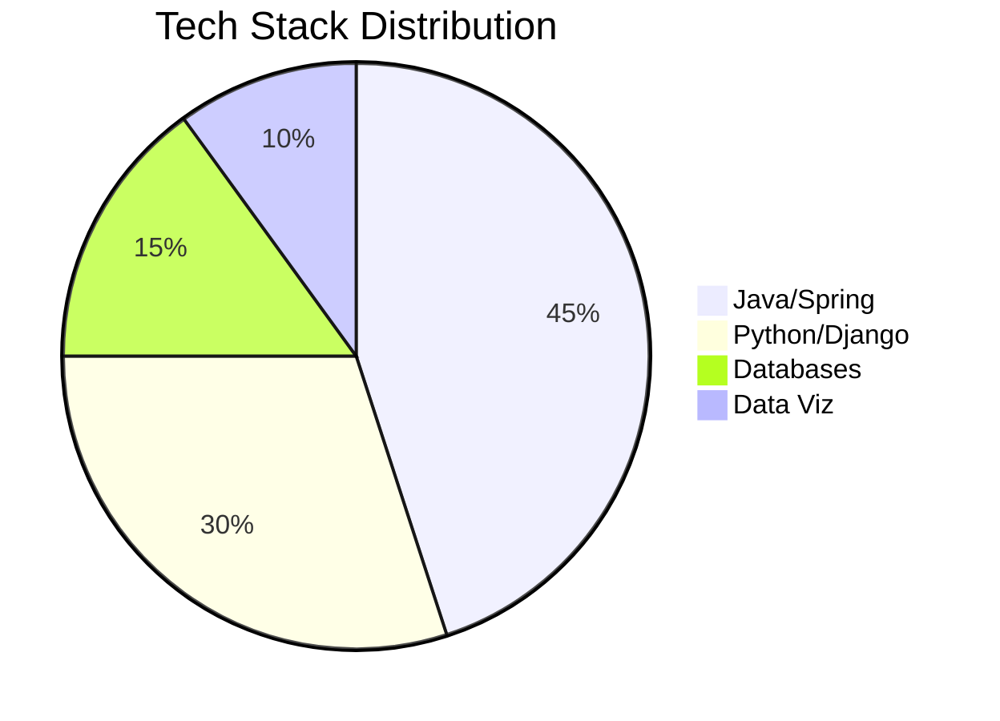

# 💻 Rahul Naik | Backend & Data Engineer

🚀 **Spring Boot Specialist** | **Django REST Expert** | **Power BI Analyst**  
📈 **Data Storyteller** | **Microservices Architect** | **Database Optimizer**  

---

## 🔧 Skill Proficiency Breakdown

### 🧠 Backend & API
- 
- 
- 

### 💾 Data & Databases
- 
- 
- 

### 📊 Data Visualization
- 
- 

### ☁️ Cloud & DevOps
- 
- 

---

## 🛠️ **Tech Stack Galaxy**

---

## 🏅 **GitHub Stats, Streak & Top Languages**

---

## 🧠 **GitHub Analytics Dashboard**

---

## 🚀 **Project Impact Metrics**

| Project              | Stars | Forks | Contributors | Activity |
|----------------------|-------|-------|--------------|----------|
| Spring Microservices |  |  |  |  |
| Django REST API      |  |  |  |  |

---

## 📈 **Code Activity Heatmap**

---

## 🏆 **Trophy Wall & Achievements**

---

## 🌐 **Connect With Me**

---

