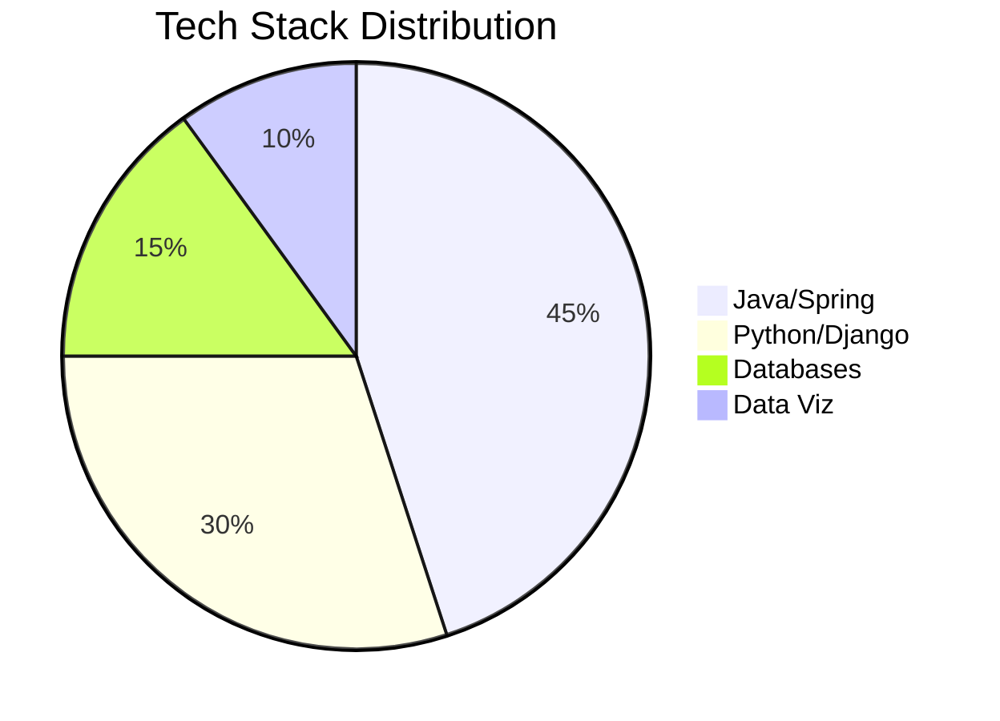

# 🚀 Rahul Naik

### Backend & Data Engineer

---

  
  
  

  
  
  

---

## 🔧 Skill Proficiency Breakdown

### 🧠 Backend & API
- 
- 
- 

### 💾 Data & Databases
- 
- 
- 

### 📊 Data Visualization
- 
- 

---

## 🛠️ Tech Stack Galaxy

---

## 🏅 GitHub Stats & Streak

---

## 🚀 Best Projects & Impact Metrics

| 🚧 Project | ⭐ Stars | 🍴 Forks | ⏱️ Last Commit | 🔗 Link |
|-----------|----------|-----------|----------------|--------|
| 🏛️ **Library Management System**   Spring Boot CRUD |  |  |  | [🔗 GitHub](https://github.com/RahulNaik2611/Library_Management) |
| 🗳️ **Voting App**   Java MVC + Spring |  |  |  | [🔗 GitHub](https://github.com/RahulNaik2611/Voting_App) |
| 📝 **Todo Tracker**   REST API + JSON |  |  |  | [🔗 GitHub](https://github.com/RahulNaik2611/Todo_App) |
| 🧮 **SpringBoot Calculator**   Backend & REST |  |  |  | [🔗 GitHub](https://github.com/RahulNaik2611/SpringBoot_Calculator) |

---

## 📈 Development Timeline

---

## 🏆 Trophy Wall

---

## 🌐 Connect With Me

  
  
  

---

